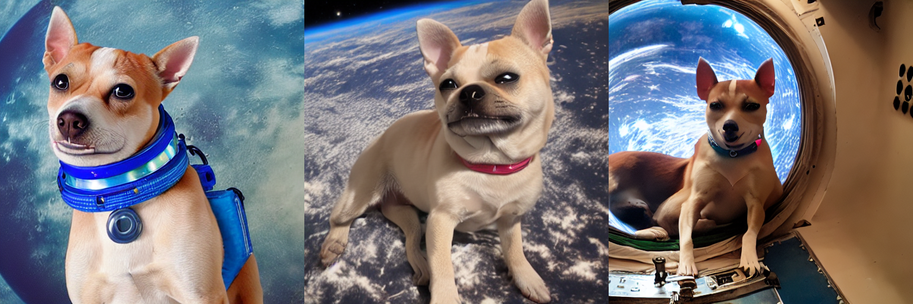
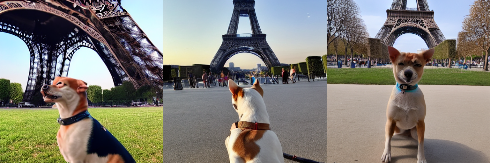
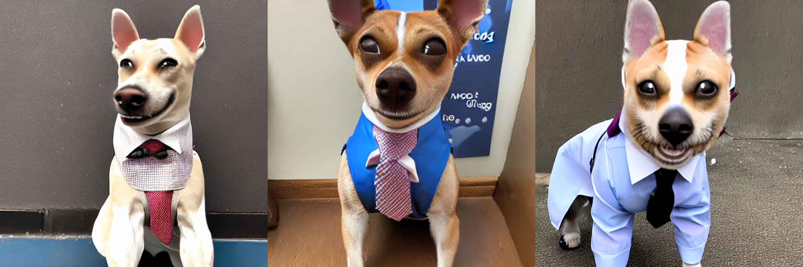

# Subject Transfer using Diffusion Models

### Problem Statement

A popular method for subject transfer is DreamBooth (https://arxiv.org/abs/2208.12242) which can serve as a starting point. Given a small set of images (e.g., pictures of my dog), the method should allow to put the main subject of the images in a new context. For instance, the prompt "A picture of <my_dog> wearing a suit." should depict the same dog from the sample images but with a novel variation of "wearing a suit". In this example, <my_dog> is a placeholder token similar to how DreamBooth is implemented. You are free to choose any other way to solve the task.


## Instructions

1. Create virtual environment and install required packages from requirements.txt

2. Download images for class images from Kaggle (since my pet is a dog, I am using a random dataset of dog images)

```
python class_images_download.py
```

Then copy it to the root directory.

3. Run Dreambooth LoRA fine-tuning with images of my pet dog.

```
bash scripts/run_dreambooth_lora.sh > dreambooth_ft_lora.log 2>&1
```

4. Enter your prompt, strength, and dreambooth_lora_ckpt path (this directory is created after running the run_dreambooth_lora.sh script)
```
bash scripts/run_inference.sh
```

## Some Results

\<vobj> : Dali (my pet dog)

1. Prompt: "A photo of \<vobj> in space"

`


2. Prompt: "A photo of \<vobj> in front of the Eiffel Tower"


2. Prompt: "A photo of \<vobj> wearing a suit and tie"

